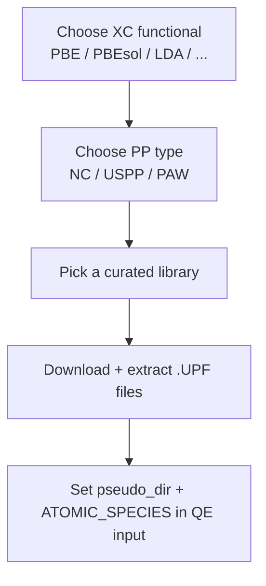
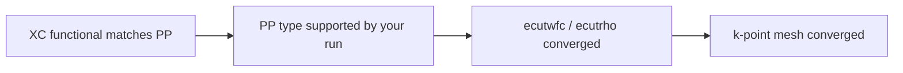

# Quantum ESPRESSO (QE) pseudopotentials

This folder contains QE-compatible pseudopotentials in **UPF** format for the workshop, plus links to trusted sources where you can download full pseudopotential libraries.



## What is in this folder

```text
psudo/
├── README.md
├── Si.pbe-n-kjpaw_psl.1.0.0.UPF
├── Si.pbe-nl-kjpaw_psl.1.0.0.UPF
├── Si.pbe-n-rrkjus_psl.1.0.0.UPF
├── Si.pbe-nl-rrkjus_psl.1.0.0.UPF
└── Si.pbe-rrkj.UPF
```

## Included in this repo (ready to use)

All files below are for **Silicon (Si)**.

| File | XC | Type (from header) | Suggested cutoffs (Ry) | Likely source |
|---|---:|---|---:|---|
| [Si.pbe-n-kjpaw_psl.1.0.0.UPF](Si.pbe-n-kjpaw_psl.1.0.0.UPF) | PBE | PAW | 44 / 175 | PSLibrary (A. Dal Corso) |
| [Si.pbe-nl-kjpaw_psl.1.0.0.UPF](Si.pbe-nl-kjpaw_psl.1.0.0.UPF) | PBE | PAW | 44 / 175 | PSLibrary (A. Dal Corso) |
| [Si.pbe-n-rrkjus_psl.1.0.0.UPF](Si.pbe-n-rrkjus_psl.1.0.0.UPF) | PBE | USPP | 44 / 175 | PSLibrary (A. Dal Corso) |
| [Si.pbe-nl-rrkjus_psl.1.0.0.UPF](Si.pbe-nl-rrkjus_psl.1.0.0.UPF) | PBE | USPP | 44 / 175 | PSLibrary (A. Dal Corso) |
| [Si.pbe-rrkj.UPF](Si.pbe-rrkj.UPF) | PBE | NC | (not specified) | older RRKJ-style UPF |

Minimal QE usage pattern:

```text
ATOMIC_SPECIES
  Si 28.0855 Si.pbe-n-kjpaw_psl.1.0.0.UPF
```

## Download full QE-compatible pseudopotential libraries (trusted sources)

Use the **Quantum ESPRESSO pseudopotentials portal** as a curated index:
- https://pseudopotentials.quantum-espresso.org/

Common QE-ready libraries (UPF):

| Library | Best for | Download / info |
|---|---|---|
| **SSSP (Standard Solid-State Pseudopotentials)** | general-purpose DFT (curated sets) | Materials Cloud archive (SSSP v1.3): https://archive.materialscloud.org/record/2023.65 |
| **PSLibrary (Dal Corso)** | broad UPF coverage (PAW/USPP/NC depending on element) | QE page: https://www.quantum-espresso.org/pseudopotentials/ps-library<br/>GitHub: https://github.com/dalcorso/pslibrary |
| **PseudoDojo** | curated NC/PAW sets (multiple “families”) | download index: https://www.pseudo-dojo.org/pseudos/ |
| **SG15 (ONCV)** | norm-conserving ONCV (benchmark-friendly) | SG15 download: https://www.quantum-simulation.org/potentials/sg15_oncv/<br/>ONCVPSP generator: https://github.com/dhamann/ONCVPSP |
| **GBRV** | ultrasoft pseudopotentials (USPP) | http://www.physics.rutgers.edu/gbrv/ |

## Learn more (recommended reading)

| Topic | Link |
|---|---|
| Unified Pseudopotential Format (UPF) | https://pseudopotentials.quantum-espresso.org/home/unified-pseudopotential-format |
| Pseudopotential file naming conventions | https://pseudopotentials.quantum-espresso.org/home/naming-convention |

## Minimal scientific checklist (before you run)



Notes:
- Do not mix pseudopotentials from different XC functionals (e.g., PBE vs LDA).
- Treat “suggested cutoffs” as a starting point only; always do convergence tests for your system.
